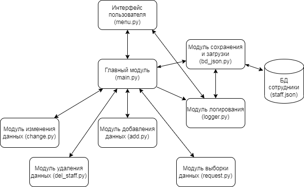

### Задача: Создать информационную систему позволяющую работать с сотрудниками некой компании \ студентами вуза \ учениками школы. Обязательно наличие внешнего хранилища информации в виде или текстового файла или файла .json.
***
## Схема модульной архитектуры приложения:

***

Для входа используйте следующие учетные данные:

Роли: логин/пароль сейчас идентичны для удобства:

*users = [('main','main'),('admin','admin'),('user','user')]*
* main - Главный Админ - может добавлять/удалять поля, и все что остальные роли
* admin - Админ - может менять значения, добавлять и удалять сотрудников и просмотр
* user - Гость - только просмотр по принципам выборки и изменять значение полей

 ### Функционал:
 - добавить сотрудника/новое поле
 - удалить сотрудника/поле
 - изменить данные всем/сотруднику, пакетная индексация окладов
 - просмотр по принципам выборки

### **menu.py**
Команды Меню - уровни:

Вход пользователя - старт (загрузка базы):

    Идет проверка логина/пароля.
    От роли строим дальнейшие варианты меню.
    В main.py загружается база (путем обращения к модулю bd_json.py) и предлагается непрерывное главное меню - до выхода пользователя.
    

1. Работа с базой 

Выбор главного действия:(здесь все пункты - для каждой роли  показываем своё)

    * добавить 
        - сотрудника
        - новое поле для карточки

    * удалить 
        - сотрудника
        - удалить поле в карточках

    * изменить данные 
        - редактировать значение поля:
            + у всех сотрудников
            + выбрать сотрудника для изменения данных
        - пакетная индексация окладов  

    * просмотр/выборка
        - по сотрудникам и полям:
            + выбрать поля для печати по всей базе
            + выбрать поля и сотрудника для печати
            + просто список сотрудников
            + полные карточки всех сотрудников
            + карточка выбранного сотрудника
            + все данные таблицей

        - выборка по значениям полей:
            Зесь три варианта:
                1. Если поле входит в список числовых - запрашивать что смотреть?
                 - конкретное значение
                 - диапазон ОТ и до
                2. Если поле содержит дату - запрашиваем как искать?
                 - отобрать значения выбранной даты по месяцу
                 - отобрать знач выбранно даты по году
                 - по месяцу и году
                3. Все другие поля - можно отобрать сотрудников просто по значению любого поля
                 - запрашиваем поле
                 - запрашиваем значение для поиска  

2. Посмотреть лог файл

Запрос на выдачу файла настроен в модуле main.py

Параметры и алгоритм записи прописаны в модуле **logger.py**
### Логирование:
1. Вход/выход - загрузка/сохранение
2. Выбор меню - запрос пользователя
3. Результат запроса - выполнено
4. Информация об ошибке на любом шаге

Все ф-ции работают по одному принципу, делают одно и то же - фиксируют событие в файл с указанием даты/времени.

Вызываются в др. модулях при каждом взаимодействии с пользователем.

Выдача лога в печать настроена в menu.py

3. Сохранить базу

Вызывается модуль **bd_json.py**, где организован функционал записи данных в файлы json. Также идет проверка исключений - в случае ошибки система не остановится, а пользователь получит уведомление.

4. Выход - сохранение данных и выход из цикла меню

Происходит автосохранение и прерывается цикл выдачи меню. 
Работа приложения прекращается.

**main.py** - главное связующее звено и модуль запуска программы.
В зависимости от выбора на стороне menu.py в main.py вызываются соответствующие модуля и функции.

Здесь мы запускаем вход в программу, в случае успеха загружаем базу и обрабатываем запросы при помощи модулей:
* add.py
* del_staff.py
* change.py
* request.py

Данные модули отвечают за внутренние процессы обработки информации и выдачу ее пользователю в нужном формате.

Графический интерфейс настроен при помощи библиотеки easygui и реализован в menu через main.

## Примеры работы модулей, переданные в интерфейс:

**add.py**

* добавление сотрудника:

Результат:

* добавление поля карточки:

**del_staff.py**

* удаление сотрудника

* удаление поля из карточек

**change.py**

* менять поля у всех

* изменить данные поля у сотрудника

* пакетная индексация окладов

**request.py**

* выбор полей для печати по всей базе

* просто список сотрудников

* карточка выбранного сотрудника

* по значению полей

например, по полу

* или по окладу в диапазоне значений

* разлиные варианты отбора по дате

и другой функционал.

***
### Команда:

Юля Малышева

Елизавета Кузьмина

Ольга Симахина 

Денис Бурдейный

Совместно определены объект для работы, структура для хранения данных, уровни меню в зависимости от роли пользователя; обозначена модульная архитектура программы и варианты выборки данных.

Ольга Симахина - проработаны модули logger и bd_json

Елизавета Кузьмина, Ольга Симахина, Денис Бурдейный - помощь в написании программы, тестировании и отладке.

Юля Малышева - обеспечена функциональность и работоспособность программы.

